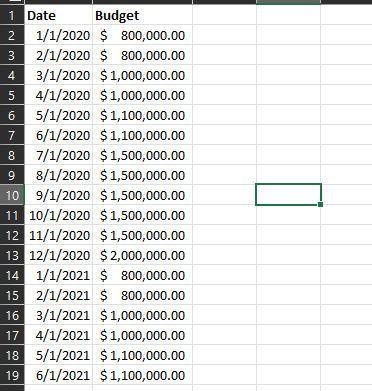

# Sales-Dashboard-project
Using SQL and Power BI

<p align="center">
  
</p>

## Skills demonstrated:
- Data Modelling
- Data Cleaning
- DAX
- report designing
- Filters

## Business Request and User Stories

The business request read in the form of an email sent along with the database data was as follows:

<p align="center">
  
</p>

A budget sheet was also provided for the year 2021 in the following excel sheet:

<p align="center">
  
</p>

## Importing data into SQL:

The database named AdventureWorksDW2019 was restored in SSMS using a .bak file. The database consisted of multiple tables, not all of which were of use in the context of our business problem.

<p align="center">
  
</p>

## Choosing the required tables and cleaning data:

The tables chosen for the purposes of our project were:
1.	DIM_Date
2.	DIM_Customer
3.	DIM_Product
4.	Fact_InternetSales

SQL queries were written to properly format the table for analysis and for ease in making a dashboard. The SQL queries for each of the tables are provided below:

### a. Cleaned and formatted date table:

```
--Cleansed DIM_DateTable
SELECT [DateKey]
      ,[FullDateAlternateKey] AS Date
      --,[DayNumberOfWeek]
      ,[EnglishDayNameOfWeek] AS day
      --,[SpanishDayNameOfWeek]
      --,[FrenchDayNameOfWeek]
      --,[DayNumberOfMonth]
      --,[DayNumberOfYear]
      ,[WeekNumberOfYear]
      ,[EnglishMonthName] AS month
	  ,LEFT([EnglishMonthName],3) AS MonthShort
      --,[SpanishMonthName]
      --,[FrenchMonthName]
      ,[MonthNumberOfYear] AS month_no
      ,[CalendarQuarter] AS Quarter
        ,[CalendarYear]
      --,[CalendarSemester]
      --,[FiscalQuarter]
      --,[FiscalYear]
      -- ,[FiscalSemester]
  FROM [AdventureWorksDW2019].[dbo].[DimDate]
  WHERE CalendarYear>=2019
```
### b. Cleaned and formatted customer table:

```
--Cleaned DIM_Customers_table
SELECT 
  c.CustomerKey 
  --,[GeographyKey]
  -- ,[CustomerAlternateKey]
  --,[Title]
  , c.FirstName AS [First Name] -- ,[MiddleName]
  , c.LastName AS [Last Name]
  , c.FirstName + ' ' + c.LastName AS [Full Name]
  --,[NameStyle]
  --,[BirthDate]
  --,[MaritalStatus]
  --,[Suffix]
  , c.Gender 
  ,CASE c.Gender WHEN 'M' THEN 'Male' WHEN 'F' THEN 'Female' END AS Gender 
  --,[EmailAddress]
  --,[YearlyIncome]
  --,[TotalChildren]
  --,[NumberChildrenAtHome]
  --,[EnglishEducation]
  --,[SpanishEducation]
  --,[FrenchEducation]
  --,[EnglishOccupation]
  --,[SpanishOccupation]
  --,[FrenchOccupation]
  --,[HouseOwnerFlag]
  --,[NumberCarsOwned]
  -- ,[AddressLine1]
  --,[AddressLine2]
  -- ,[Phone]
  , c.DateFirstPurchase AS [First Purchase] --,[CommuteDistance]
  , g.City --Joined Geography table
FROM 
  [AdventureWorksDW2019].[dbo].[DimCustomer] AS c 
  LEFT JOIN [AdventureWorksDW2019].[dbo].[DimGeography] AS g ON g.GeographyKey = c.GeographyKey
```
### c. Cleaned and formatted Product table:
```
--Cleaning Dim_ProductTable
SELECT  p.[ProductKey]
      ,p.[ProductAlternateKey] AS [Product Item Code]
--      ,[ProductSubcategoryKey]
--      ,[WeightUnitMeasureCode]
--      ,[SizeUnitMeasureCode]
		,p.[EnglishProductName] AS [Product Name]
		,ps.EnglishProductSubcategoryName AS [Sub Category]--Joined in from Sub Category table
		,pc.EnglishProductCategoryName AS [Product Category]--Joined in from Caegory Table
--      ,[SpanishProductName]
--      ,[FrenchProductName]
--      ,[StandardCost]
--      ,[FinishedGoodsFlag]
      ,p.[Color] AS [Product Color]
--      ,[SafetyStockLevel]
--      ,[ReorderPoint]
--      ,[ListPrice]
      ,p.[Size] AS [Product Size]
--      ,[SizeRange]
      ,p.[Weight] AS [Product Weight]
--      ,[DaysToManufacture]
      ,p.[ProductLine] AS [Product Line]
--      ,[DealerPrice]
--      ,[Class]
--     ,[Style]
      ,p.[ModelName] AS [Product Model Name]
--      ,[LargePhoto]
      ,p.[EnglishDescription] AS [Product Discription]
--      ,[FrenchDescription]
--      ,[ChineseDescription]
--      ,[ArabicDescription]
--      ,[HebrewDescription]
--      ,[ThaiDescription]
--      ,[GermanDescription]
--      ,[JapaneseDescription]
--      ,[TurkishDescription]
--      ,[StartDate]
--      ,[EndDate]
  ,ISNULL(p.Status, 'Outdated') AS [Product Status]
  FROM [AdventureWorksDW2019].[dbo].[DimProduct] AS p
  LEFT JOIN [AdventureWorksDW2019].[dbo].[DimProductSubcategory] AS ps ON ps.ProductSubCategoryKey = p.ProductSubcategoryKey
  LEFT JOIN [AdventureWorksDW2019].[dbo].[DimProductCategory] AS pc ON ps.ProductCategoryKey = pc.ProductCategoryKey
  ORDER BY 
	p.ProductKey asc

```
### d. Cleaned and formatted Fact_internet sales table:
```
--Cleaned FACT_InterneSales Table--
SELECT 
  [ProductKey], 
  [OrderDateKey], 
  [DueDateKey], 
  [ShipDateKey], 
  [CustomerKey] 
  --      ,[PromotionKey]
  --     ,[CurrencyKey]
  --      ,[SalesTerritoryKey]
  , 
  [SalesOrderNumber] 
  --      ,[SalesOrderLineNumber]
  --      ,[RevisionNumber]
  --      ,[OrderQuantity]
  --      ,[UnitPrice]
  --      ,[ExtendedAmount]
  --      ,[UnitPriceDiscountPct]
  --      ,[DiscountAmount]
  --      ,[ProductStandardCost]
  --      ,[TotalProductCost]
  , 
  [SalesAmount] 
  --      ,[TaxAmt]
  --      ,[Freight]
  --     ,[CarrierTrackingNumber]
  --      ,[CustomerPONumber]
  --      ,[OrderDate]
  --      ,[DueDate]
  --      ,[ShipDate]
FROM 
  [AdventureWorksDW2019].[dbo].[FactInternetSales] 
WHERE 
  LEFT(OrderDateKey, 4) >= 2019 --Ensures we always have the dae 2 years from current
ORDER BY 
  OrderDateKey asc
```
The results of each of the queries were then saved in a .csv file to be used in PowerBI.

## Loading Data into PowerBI and making a Data Model:

Each of the .csv tables were then loaded into PowerBI and a data model was then built to connect the tables:

<p align="center">
  
</p>

<em>Note: The budget excel file was also loaded and connected as can be seen above. A separate table for Key Measures was made later for ease of access and to avoid cluttering (mentioned later)</em>

Some of the data types of the columns were transformed in the Transform tool option in PowerBI. 

##  Making key measures to use as KPIs and putting them in a separate table:

Key Measures including:
- Sum of Sales
- Total Budget amount
- difference between Sales and Budget

were created for the purposes of our analyses. A separate table called 'Key Measures' stored all of the variables:

<p align="center">
  
</p>

## Constructing a dashboard:

Line Graphs, Donut Charts, Bar Charts and World Map features were combined to tell a comprehensive store to out stakeholders at a glance.

Slicers were added to sort by Customer City, Product Sub Category and Product Name. 

The final dashboard is as follows and the link to the interactive dashboard is given [here](https://app.powerbi.com/links/qVdoeBlLeW?ctid=402d2a37-422a-4cb6-9563-6afdf0cd3a39&pbi_source=linkShare):

<p align="center">
  
</p>
